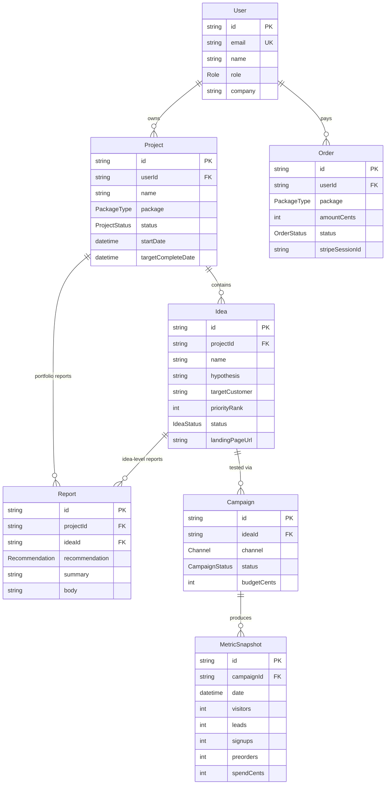

# Database schema

Source of truth: [`prisma/schema.prisma`](../prisma/schema.prisma). This doc explains the
*why* behind the shape — read the schema file for the exact fields and types.

SQLite locally (zero-setup, file-based — see `prisma/dev.db`), swap to Postgres in production
by changing `provider` and `DATABASE_URL` in `prisma/schema.prisma`; the schema itself is
already Postgres-compatible (no SQLite-only types are used).

## Entity relationship diagram

## Why this shape

**`Project` is the unit of sale, `Idea` is the unit of testing.** A client buys one package
(`Project`), which can contain one idea (Idea Check, Market Test, Presale Sprint) or several
(Validation Sprint tests 3-5 in parallel). This lets one dashboard query
(`project.ideas`) drive both a single-idea Market Test page and a five-idea Validation
Sprint portfolio view without special-casing either.

**`Campaign` sits between `Idea` and raw numbers because one idea is tested on more than one
channel.** Ledger (see the seed data) runs simultaneously on paid social and email — each with
its own budget, timeline, and performance. Rolling those up (`sumMetrics()` in
[`src/lib/metrics.ts`](../src/lib/metrics.ts)) at the `Idea` or `Project` level is a
reduce over children, not a schema concern.

**`MetricSnapshot` is append-only, dated rows — not a running total.** Every scrape/sync writes
a new row for a given day rather than incrementing a counter. That makes the data
re-derivable (recompute totals for any date range), auditable (you can see the day something
started converting), and trivially chartable.

**`Report` can point at an `Idea` or stand alone at the `Project` level.** A Validation Sprint
produces one report per idea (`ideaId` set) *and* one portfolio summary report comparing all of
them (`ideaId` null). The optional FK is what makes both cases the same table instead of two.

**`Order` is deliberately decoupled from `Project`.** A Stripe payment creates an `Order`; a
`Project` gets created (by us, during intake) once we've actually scoped the engagement. They're
linked by `userId` and time proximity, not a hard foreign key — because in practice there's a
conversation between "paid" and "project scoped and kicked off," and forcing a 1:1 FK would
make that gap invisible instead of modelable.

## Where it's read

- `src/lib/current-user.ts` — placeholder auth; single lookup function every dashboard page
  calls through, so real auth is a one-file swap later.
- `src/app/dashboard/**/page.tsx` — all dashboard reads, via `prisma` directly in Server
  Components (no API layer needed for first-party reads).
- `src/app/api/webhooks/stripe/route.ts` — the only writer of `Order` rows outside `prisma/seed.ts`.
- `src/app/api/contact/route.ts` — writes `ContactSubmission` (not diagrammed above; a flat
  inbox table, see the schema file).

## Extending it

Adding real auth: add a `Session`/`Account` model (or point `getCurrentUser()` at your auth
provider's session) — nothing else in the dashboard needs to change, since every page already
reads through that one function.

Adding team accounts: introduce an `Organization` model between `User` and `Project`
(`Project.organizationId` instead of `userId`), with a join table for membership. `Order` would
move to the same FK.
