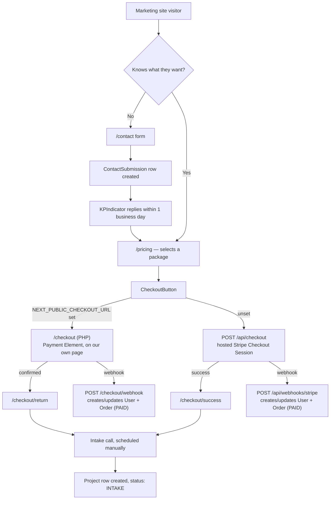
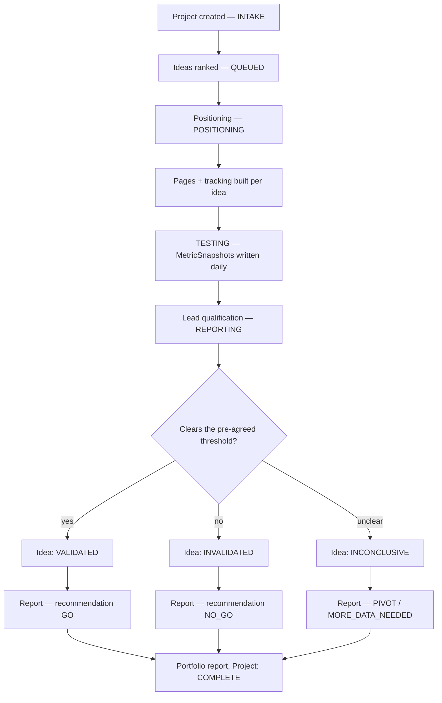
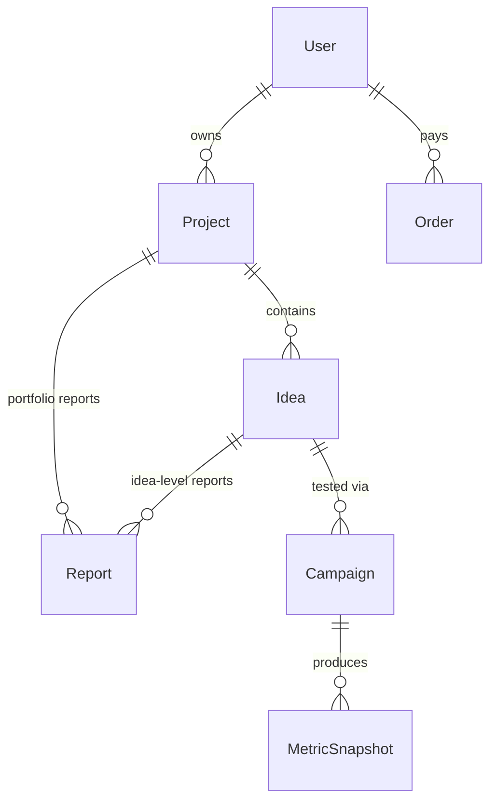

# Product spec — kpindicator.com

**KPIndicator** — done-for-you market validation and product-building. Test 3–5 ideas with real
landing pages and real traffic, find out what actually converts, then build the one that hits.

| | |
|---|---|
| Prepared | 28 Aug 2026 |
| Source of truth | github.com/NicklasSandin/kpindicator |
| Live at | kpindicator.com |
| Stage | Standalone demo, pre-revenue |

---

## 01 Overview & fit

KPIndicator sells evidence, not opinions. A client brings ideas; KPIndicator puts real landing
pages, real ad spend, and real outreach behind them and reports back what actually happened — a
go, a no-go, or a specific reason to pivot. The product is three things at once: a marketing site
that sells the service, a client dashboard that shows a project's live data and final reports, and
an internal admin tool for KPIndicator's own prospecting.

### Who it's for

- **Founders with capital, no patience for guessing** — would rather spend $5k finding out than
  $150k finding out later.
- **Startup studios & incubators** — running a portfolio model, need a repeatable way to rank
  ideas before committing a founder's time.
- **Corporate innovation teams** — need external, credible signal for a steering committee, not
  another internal opinion.
- **Agencies validating for clients** — want a white-label validation partner instead of building
  an internal ads team.

### Who it's not for

- **Anyone who wants a report that says yes** — KPIndicator reports what the market says; a clear
  no, explained, is the point of paying for this.
- **Sub-$500 budgets** — real traffic costs real money; an Idea Check is the honest floor, not a
  discount on the rest.
- **Teams building regardless of the answer** — if the decision to build is already made, save the
  spend for the build.
- **48-hour turnaround requests** — statistically meaningful demand signal takes at least a week
  or two.

---

## 02 The offering

Three product lines, same testing methodology applied to three different moments in a company's
life: an idea that doesn't exist yet, a product that already exists but has plateaued, and a
validated idea that needs a legal entity to receive money.

### Validate — pre-launch idea testing

Routes: `/pricing`, `/validate`

| Package | Price | Timeline | Promise | Includes |
|---|---|---|---|---|
| **Idea Check** | $995 | 3–5 business days | Know if it's worth building before you spend a dollar on it. | Competitor + market research · Pricing analysis · Written go / no-go assessment |
| **Market Test** | $2,500 | 2 weeks | Put one idea in front of real people and watch what happens. | Landing page + domain setup · Analytics & lead capture · Initial paid traffic campaign |
| **Validation Sprint** | $4,900 | 3–4 weeks | Test 3–5 ideas at once, kill the losers, double down on what hits. | Everything in Market Test, per idea · Multi-channel outreach · Final ranked report |
| **Presale Sprint** | $8,500 | 4–6 weeks | Stop asking if they'd buy it. Get them to put money down. | Booked demo / deposit flow · Conditional preorder mechanics · Presale revenue report |

**Introductory pricing:** the first 5–10 clients get Market Test at $2,500 while KPIndicator builds
case studies from real results; it then moves to $4,500–$6,000 per idea.

| Feature | Idea Check | Market Test | Validation Sprint | Presale Sprint |
|---|---|---|---|---|
| Ideas covered | 1 | 1 | 3–5 | 1 |
| Competitor & market research | Yes | — | Yes | Yes |
| Landing page + tracking | — | Yes | Yes | Yes |
| Paid traffic | — | Initial | Full | Full |
| Email + social outreach | — | — | Yes | Yes |
| Lead qualification & interviews | — | — | Yes | Yes |
| Booked demos / preorder flow | — | — | — | Yes |
| Written go / no-go report | Yes | — | Yes | Yes |

### Grow — for products that already exist

Route: `/grow`

| Package | Price | Timeline | Promise | Includes |
|---|---|---|---|---|
| **Growth Check** | $995 | 3–5 business days | Know what's actually stalling growth before you spend on it. | Funnel & analytics review · Channel + pricing gap analysis |
| **Growth Test** | $2,500 | 2 weeks | Put one growth bet in front of real traffic and watch what happens. | Variant page / offer build · Before/after comparison |
| **Growth Sprint** | $4,900 | 3–4 weeks | Test 3–5 growth bets in parallel, double down on what hits. | Multi-channel testing · Head-to-head ranked report |

### Incorporate — for a validated idea ready to take money

Route: `/incorporate`

| Tier | Promise | Includes |
|---|---|---|
| **Formation Basics** | The entity itself, done correctly the first time. | Entity formation & filing · EIN / tax ID · Registered agent, year one |
| **Formation + Banking** | Ready to actually take money, not just exist on paper. | Everything in Basics · Bank account setup support · Cap table + founder agreement |
| **Full Company Setup** | Formation, banking, and the compliance calendar so nothing lapses. | Everything in +Banking · Agreement templates · Annual compliance calendar |

---

## 03 How a project runs

The eight steps every Validate/Grow engagement moves through, in order — this sequencing is itself
part of the product (budget goes where it teaches the most, first).

| # | Step | What happens | When |
|---|---|---|---|
| 01 | Intake & idea prioritization | Score each idea on market size, urgency, and signal cost; sequence the test plan. | Day 1–2 |
| 02 | Positioning & offer design | A specific offer per idea — who it's for, what it replaces, what it costs. | Day 2–4 |
| 03 | Landing page + tracking setup | A real page on a real domain, instrumented before the first visitor. | Day 3–6 |
| 04 | Multi-channel demand testing | Paid, email, and outreach run in parallel — one channel alone can lie to you. | Week 1–3 |
| 05 | Real-time measurement | Every visitor, click, and lead flows to the client's dashboard from day one. | Ongoing |
| 06 | Lead qualification & interviews | A form fill isn't demand — talk to the people who raised a hand. | Week 2–4 |
| 07 | Final validation report | One report per idea, one portfolio summary for a batch — a straight call, no hedge. | Final 2–3 days |
| 08 | Build the winner (optional) | Ideas that validate can move straight into build — same team, no re-onboarding. | Scoped separately |

---

## 04 Core flows

Two flows worth understanding end to end. Full detail on all five (including outbound-marketing
tracking) lives in [user-flows.md](./user-flows.md).

### Client onboarding — visitor to paid project

### Project lifecycle — intake to final report

---

## 05 Product surfaces

One codebase, three audiences, each behind its own auth check.

**Marketing site** — public, every visitor

- `/` home
- `/pricing` packages + comparison
- `/process` the 8 steps
- `/case-studies`, `/blog` MDX content
- `/grow`, `/incorporate` the other two lines
- `/contact` → email + DB row
- `/signup`, `/login` real session auth

**Client dashboard** — signed-in clients, `getCurrentUser()`

- `/dashboard` overview
- `/dashboard/projects/[id]` ideas, campaigns, live metrics
- `/dashboard/reports/[id]` full validation report
- `/onboarding` first-login persona picker

**Internal admin** — KPIndicator staff only, `getCurrentAdmin()`

- `/admin` campaign portfolio view
- `/admin/campaigns/[id]` funnel + per-recipient engagement
- `/admin/campaigns/new` draft a campaign, paste recipients

---

## 06 Data model

Two independent domains in one schema — don't conflate them. The client-facing domain (below)
tracks a client's paid work; a separate `EmailCampaign → EmailRecipient → EmailEvent` chain (not
pictured) tracks KPIndicator's own outbound prospecting and is unrelated to a client's `Campaign`.

`Order` and `Project` are linked by `userId` and timing, not a hard foreign key — project creation
is a deliberate manual step after a sales call, not an automatic continuation of checkout.

---

## 07 The report

Every report — from a $995 assessment to an $8,500 presale results report — follows one structure,
so reports read side by side without relearning a format.

Recommendations: **GO** (cleared the threshold) · **NO-GO** (stop or re-scope) · **PIVOT** (signal
on the need, not the framing) · **MORE DATA NEEDED** (genuine gray zone).

| Section | Field | Content |
|---|---|---|
| Letterhead | `publishedAt` | Prepared-by, report type, publish date, project + package. |
| Title | `title` | One line naming the idea and report type. |
| Executive summary | `summary` | One or two sentences, no hedging. |
| Recommendation | `recommendation` | A Prisma enum, not free text — a report can't quietly avoid a position. |
| Key metrics | `sumMetrics()` | Same numbers the client already saw live on the dashboard mid-test. |
| Narrative body | `body` (MDX) | The situation → what was tested → what happened → the call → risks/caveats. |
| Footer | — | Prepared-by + date, so a report read six months later is self-dating. |

---

## 08 Build status

What's actually implemented today versus what the spec above describes as the target — checked
directly against the running production instance, not assumed.

| System | State | Note |
|---|---|---|
| Marketing site + content | Live | All pages, MDX case studies/blog, all three product lines. |
| Client auth (signup/login/sessions) | Live | Cookie sessions, scrypt-hashed passwords, verified end to end. |
| Database | Live | PostgreSQL in production, migrated + seeded. |
| Contact form → admin notification | Wired, not delivering | AWS SES integrated; blocked on DNS domain verification + sandbox recipient verification. |
| Stripe checkout (hosted) | Not configured | `/api/checkout` + `/api/webhooks/stripe`. Degrades gracefully to a contact-form fallback without live keys. |
| Custom checkout (PHP) | Built, not configured | `/checkout` — Payment Element on our own page, no Composer dependencies. Needs a publishable key and a webhook secret; see `checkout/README.md`. Set `NEXT_PUBLIC_CHECKOUT_URL` to route buyers to it. |
| PostHog analytics | Not configured | No-ops without a key. |
| Outbound email marketing (admin) | Tracking only | Campaign/recipient/funnel views built; no ESP wired up to actually send. |
