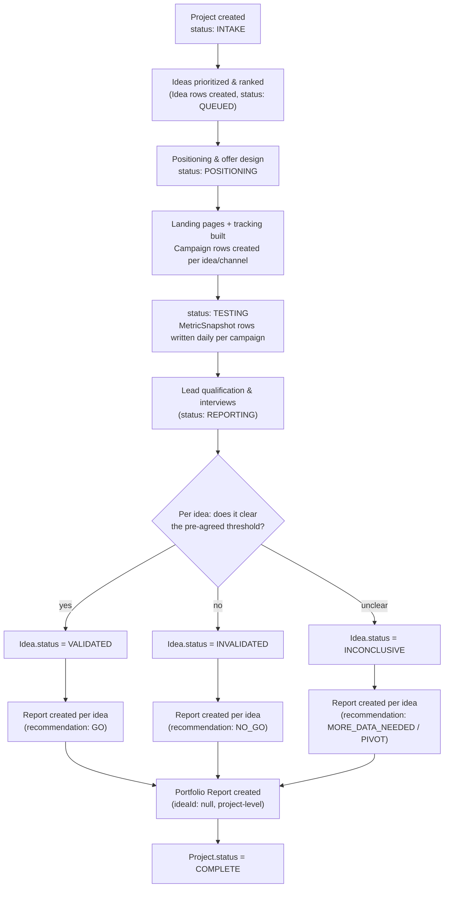
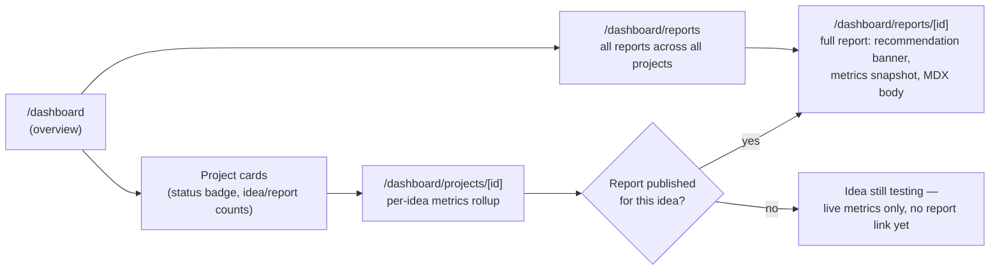
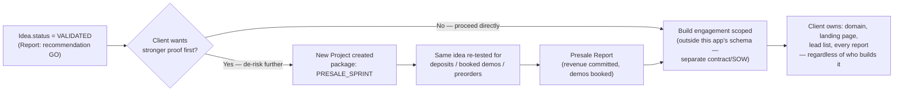

# Key user flows

Four flows worth understanding end to end: how a visitor becomes a paying client, how a
purchased package becomes a running project, how a running project produces a result, and how a
validated result turns into a build. Each maps to real routes and data in this codebase.

## 1. Client onboarding — visitor to paid project

```mermaid
flowchart LR
    A[Marketing site visitor] --> B{Knows what they want?}
    B -- "No, needs to talk it through" --> C["/contact form\n(src/components/marketing/contact-form.tsx)"]
    B -- "Yes, ready to buy" --> D["/pricing\nselects a package"]
    C --> E[ContactSubmission row created]
    E --> F[WhatHits replies within 1 business day]
    F --> D
    D --> G["CheckoutButton → POST /api/checkout\n(src/app/api/checkout/route.ts)"]
    G --> H[Stripe Checkout Session]
    H -- success --> I["/checkout/success"]
    H -- webhook: checkout.session.completed --> J["POST /api/webhooks/stripe\ncreates/updates User + Order (PAID)"]
    I --> K[Intake call scheduled manually]
    K --> L["Project row created\n(status: INTAKE)"]
```

**Where this is soft today:** step K→L (scheduling the intake call, creating the `Project` row)
is a manual, human step — deliberately. A $995-$8,500 engagement starts with a real
conversation, not a fully automated signup flow. The `Order` and the `Project` are linked by
`userId` + timing, not a hard foreign key (see [database-schema.md](./database-schema.md#why-this-shape)).

## 2. Project lifecycle — intake to final report

This is the [8-step process](../src/content/process.ts) rendered on the marketing site, mapped
to `ProjectStatus` and `IdeaStatus`:

**Multi-idea batches (Validation Sprint) run steps D-M in parallel across 3-5 ideas** — this is
why `Idea` and `Campaign` are separate rows from `Project`, not columns on it.

## 3. Viewing results — client dashboard

Every number on these pages is a live Prisma query (`export const dynamic = "force-dynamic"`
on the dashboard layout — see [database-schema.md](./database-schema.md#where-its-read)), not a
static snapshot from build time.

## 4. Build handoff — validated idea to build kickoff

The seed data (`prisma/seed.ts`) models exactly this: **Project A** (Q2 Idea Batch, Validation
Sprint, `COMPLETE`) validates Ledger, and **Project B** (Ledger — Presale Sprint, `TESTING`) is
that same idea one step further down this flow — a second `Project` row, not a status change on
the first, because it's a separately-scoped, separately-billed engagement.
